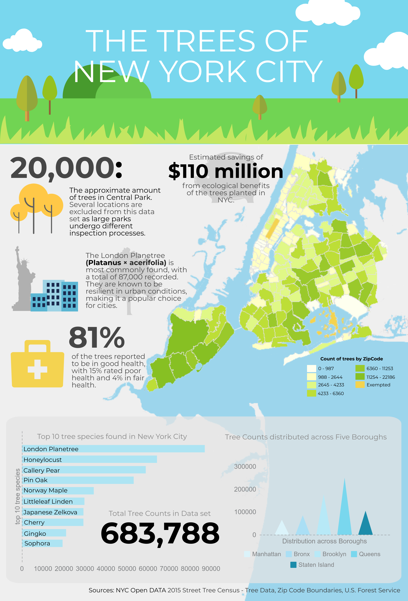

Trees are important in urban environments, mitigating the negative effects of urban heat island effects. 
Here, official data from NYC OPEN DATA shows data on trees in New York City across the five boroughs.

